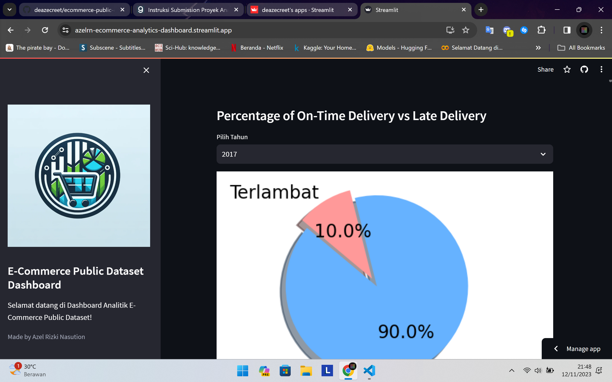
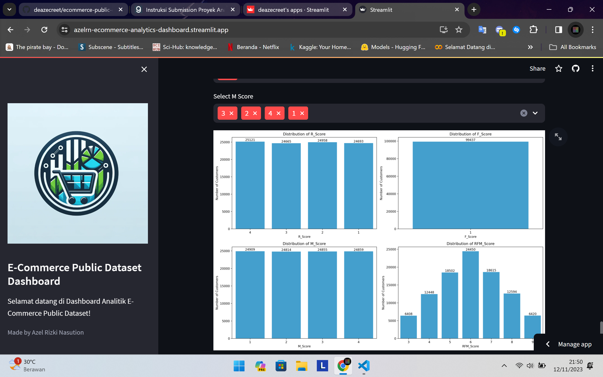

# E-Commerce Public Dataset Analysis Dashboard

## Library Requirements

- Python 3.9 atau lebih tinggi
- Streamlit
- Pandas
- Matplotlib
- Seaborn

## Setup environment

```
conda create --name main-ds python=3.9
conda activate main-ds
pip install streamlit pandas matplotlib seaborn
```

## Run Streamlit App

```
streamlit run dashboard.py
```

## Link Dashboard Analytics Streamlit

https://azelrn-ecommerce-analytics-dashboard.streamlit.app/

## Contoh Screenshoot Dashboard Analytics Streamlit

### Contoh Screenshoot Tampilan Awal



### Contoh Screenshoot Tampilan Akhir


